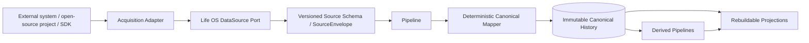
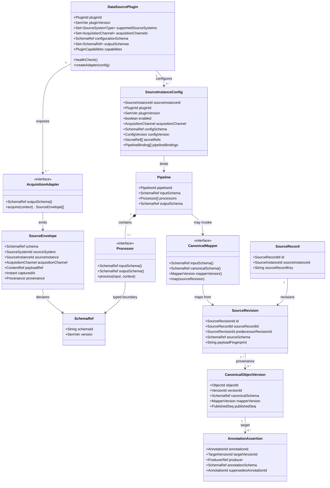
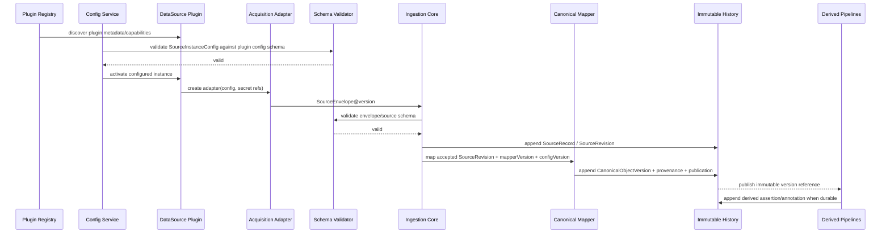
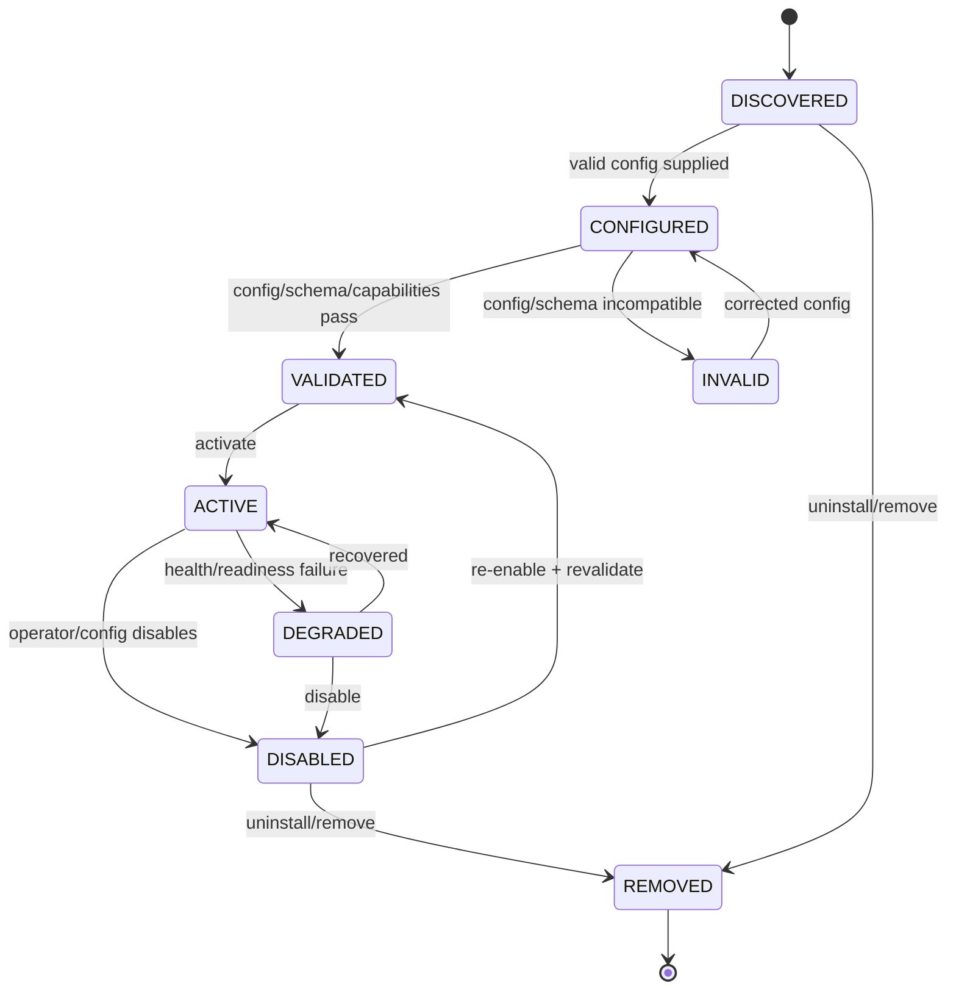
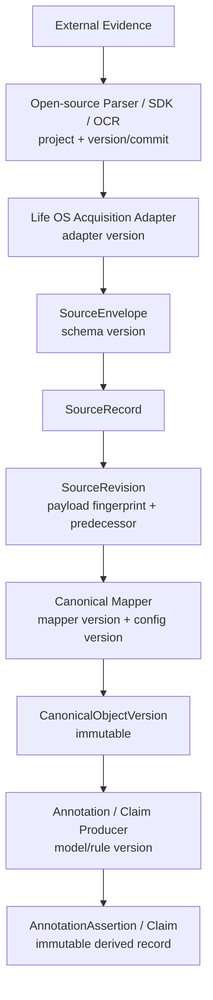
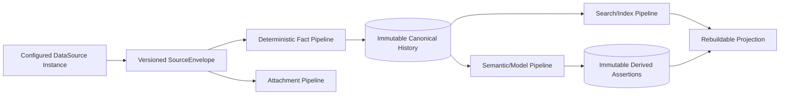

# Shawn Life OS — DataSource Plugin Architecture

Status: Long-term architecture design. This document defines the pluggable/configurable DataSource boundary and its UML/diagram-as-code representation.

## 1. Purpose

Life OS treats each external origin of evidence as a **DataSource** and each concrete way of acquiring from it as an **Acquisition Adapter**. DataSource support must be pluggable, declaratively configurable, schema-versioned, pipeline-compatible, and isolated from canonical core semantics.

The core owns semantic invariants, provenance, revision identity, canonical mapping contracts, publication, privacy boundaries, and immutable history. Source-specific acquisition and commodity parsing/OCR/API behavior remain outside the core and are normally implemented by reusing mature open-source projects behind thin adapters.

## 2. Required dependency direction

The canonical core must not directly depend on vendor-specific representations.

## 3. UML class/domain model

## 4. DataSource plugin contract

Every plugin must declare, at minimum:

- stable `pluginId` and plugin version;
- supported source-system type(s);
- acquisition channel(s);
- configuration schema and version;
- output semantic schema(s) and versions;
- required capabilities/runtime prerequisites;
- health/readiness behavior;
- secret references, never embedded secret values;
- provenance metadata sufficient to reproduce acquisition;
- compatible pipeline bindings;
- explicit failure behavior.

A plugin may expose multiple acquisition adapters. For example, a WeChat DataSource may support screenshot, backup database, export file, and a future API adapter while retaining the same logical DataSource identity and downstream canonical model.

## 5. Configuration model

DataSource instances are declaratively configured. Core domain code must not be edited merely to add, enable, disable, or reconfigure a source plugin.

Configuration may control:

- enabled/disabled state;
- plugin and adapter selection;
- source-instance identity;
- import/poll/event mode;
- path/endpoint/device/account references;
- credentials via `SecretRef`;
- pipeline bindings;
- privacy/egress policy;
- retention policy;
- resource/rate limits;
- plugin-specific options.

Configuration is validated against the plugin-declared schema before activation. Configuration that changes semantics or canonical mapping behavior must be versioned and referenced in provenance so historical outputs remain reproducible.

## 6. Versioned semantic schema rule

Every pipeline-visible output declares a versioned semantic schema. Untyped or unversioned JSON is not a durable contract.

Typical boundaries:

`SourceEnvelope -> source-native normalized schema -> deterministic canonical schema -> derived/annotation schema -> projection/API schema`

A schema defines **meaning**, not only JSON shape. For example, timestamp semantics must specify origin, precision, timezone interpretation, and whether a timestamp was source-reported, observed, inferred, or normalized.

Schema changes are explicit versions. A semantic change is not silently applied to historical records; it requires a new schema and/or mapper version.

## 7. Ingestion sequence UML

No model step is permitted in the deterministic fact path unless the output remains explicitly derived and does not directly create/overwrite canonical fact state.

## 8. Plugin lifecycle UML

Failures are explicit and fail closed. A missing, unhealthy, disabled, or incompatible plugin must not silently substitute another source or fabricate evidence.

## 9. Data lineage / provenance UML

The system must be able to reconstruct the path from any durable canonical/derived record back to source evidence and the exact parser/adapter/schema/mapper/configuration/producer versions involved.

## 10. Pipeline fan-out

A single configured DataSource instance may feed multiple pipelines as long as each binding is schema-compatible and provenance is retained.

The DataSource plugin owns acquisition/source-native normalization. It does **not** own canonical resolution or downstream interpretation.

## 11. WeChat as the first real plugin slice

WeChat is a DataSource, not a screenshot feature.

Initial adapter path:

`WeChat DataSource -> screenshot adapter -> WhoChat parser/replay + mature OCR provider -> wechat.normalized-chat@1.x -> Life OS ingestion pipeline -> immutable source revisions -> deterministic canonical message mapping`

Possible future adapters:

- backup DB adapter;
- export-file adapter;
- other lawful/local acquisition methods;
- future official API adapter if available.

All adapters retain the same logical source-system identity while recording their distinct acquisition channel and provenance.

## 12. Open-source-first rule

A DataSource plugin should normally wrap mature open-source projects/SDKs/parsers rather than duplicate their internals. Life OS-owned code should focus on:

- stable port/adapter boundary;
- configuration and schema validation;
- provenance and source identity;
- privacy/egress boundary;
- deterministic canonical mapping;
- pipeline integration;
- reproducible tests and real-data validation.

Any broader custom implementation requires a documented reuse rejection decision.

## 13. Diagram governance

These diagrams are normative architecture aids and must remain consistent with the written invariants. They do not replace schemas, requirements, acceptance criteria, or executable tests.

Use diagram-as-code so architecture changes are diffable and reviewable. Update affected diagrams before implementing a relationship/lifecycle/dataflow change under the Document First rule.