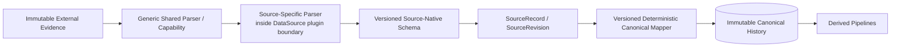

# Shawn Life OS — Parsing and Normalization Architecture

Status: Long-term architecture design. This document defines where generic parsing, source-specific parsing, normalization, and canonical mapping belong.

## 1. Principle

Parsing is not a single layer. Shawn Life OS separates:

1. **Generic Parsing Infrastructure** — understands reusable formats or media representations.
2. **Source-Specific Parsing** — understands the semantics/layout/protocol conventions of one DataSource.
3. **Source-Native Normalization** — emits a versioned source-domain representation.
4. **Canonical Mapping** — deterministically maps supported source-native facts into Life OS canonical semantics.
5. **Derived Interpretation** — optional statistical/model/semantic processing above canonical facts.

The boundary is semantic:

- Generic parser answers: **"How do I read this format?"**
- Source parser answers: **"What does this source-specific structure mean?"**
- Canonical mapper answers: **"How does this source fact map into Life OS canonical semantics?"**

## 2. Architecture



Not every acquisition path needs every step. Structured exports may bypass OCR or media parsing, but every durable boundary still uses a versioned semantic schema and provenance.

## 3. Generic Parsing Infrastructure

Generic parsers are reusable across multiple DataSources and belong in shared infrastructure behind stable capability ports/provider adapters when a mature reusable implementation exists.

Typical examples:

- JSON / XML / CSV parsing;
- MIME / email container parsing;
- PDF text/object extraction;
- archive/decompression;
- image decoding and metadata/EXIF extraction;
- media container/codec metadata;
- OCR;
- generic document parsing;
- generic table extraction where source-neutral;
- generic timestamp/encoding decoding where semantics are format-defined rather than source-defined.

These capabilities answer format-level questions and must not embed WeChat-, Gmail-, Health Connect-, or other DataSource-specific business meaning.

Preferred dependency direction:

`DataSource Adapter -> Life OS Shared Capability Port -> Provider Adapter -> open-source/external implementation`

## 4. Source-Specific Parsing

Source-specific parsing belongs to the relevant DataSource plugin boundary because it interprets source-specific structure and semantics.

For WeChat screenshot ingestion this includes, for example:

- chat bubble segmentation;
- left/right bubble ownership semantics;
- identifying self vs counterpart when deterministically supported;
- timestamp separator recognition and association;
- ordering visible messages;
- system-message detection;
- image/voice/file/sticker/red-packet/call/message-type recognition when supported by evidence;
- partial screenshot handling;
- overlapping screenshot/replay reconciliation rules;
- source-specific layout/version quirks.

This parser may itself be pluggable/configurable within the DataSource plugin. For example:

```text
WeChatSourceParserPort
  -> WhoChat parser adapter
  -> alternative parser adapter
  -> future native/export parser
```

The parser implementation should be reused from mature open-source projects where possible. Life OS should not copy or reimplement the parser algorithm merely to avoid the adapter boundary.

## 5. Source-native normalization

The output of source-specific parsing is a versioned source-native semantic schema, not canonical Life OS facts.

Example:

```text
wechat.normalized-chat@1
  - conversation-local message representation
  - sender side / source identity evidence
  - visible/source-reported timestamps
  - message type
  - text/content references
  - screenshot geometry when relevant
  - OCR/source-parser confidence or uncertainty metadata
  - acquisition provenance
  - parser/provider/version provenance
```

Source-specific fields that do not belong in canonical semantics remain here or in evidence metadata rather than being discarded.

## 6. Canonical mapper boundary

Canonical mapping is separate from parsing.

A `CanonicalMapper` consumes an accepted `SourceRevision` whose payload conforms to a versioned source-native schema and deterministically produces zero or more canonical object/fact versions.

Required reproducibility:

`same accepted SourceRevision + same source schema version + same mapper version + same relevant configuration -> same canonical output`

Canonical mapping must not silently infer source meaning that belongs in an ambiguous/model-based layer.

## 7. OCR + parsing example for WeChat

```mermaid
flowchart LR
    IMG[WeChat Screenshot Evidence]
    OCR[Shared OcrPort / Provider]
    ORES[ocr.result@version\nExtracted Evidence]
    WPARSE[WeChatSourceParserPort\nWhoChat adapter]
    WN[wechat.normalized-chat@version]
    REV[SourceRevision]
    MAP[WeChat Canonical Mapper\nversioned deterministic code]
    MSG[(Canonical Message Versions)]

    IMG --> OCR --> ORES --> WPARSE --> WN --> REV --> MAP --> MSG
```

OCR and WeChat parsing are therefore different architectural responsibilities:

- OCR is shared infrastructure.
- WeChat layout/message parsing is source-specific plugin logic, preferably backed by a reused parser project.
- canonical message mapping belongs to the deterministic canonical mapping layer.

## 8. Structured WeChat sources

A screenshot is only one acquisition channel. A backup/export adapter may follow a different path:

```text
WeChat backup/export evidence
  -> generic SQLite/JSON/file parser where applicable
  -> WeChat backup/export source parser
  -> wechat.normalized-chat@version
  -> SourceRevision
  -> same canonical mapper contract
```

Multiple acquisition channels should converge on compatible source-native schemas when their semantics match, while preserving acquisition-specific provenance.

## 9. Parser configuration and provenance

Every durable parser-visible output records enough information to reproduce interpretation, including as applicable:

- parser ID;
- parser adapter version;
- upstream open-source project/repository;
- pinned release/tag/commit;
- configuration version/hash;
- source schema version;
- upstream capability result references, such as OCR result IDs;
- warnings/partial/unsupported status;
- deterministic preprocessing versions;
- source evidence references.

Parser fallback/substitution must be explicit and provenance-recorded. Silent substitution is prohibited when it can change semantics or reproducibility.

## 10. Failure and uncertainty

A parser must be able to return partial/unsupported/ambiguous results rather than fabricating a complete source record.

Uncertain information remains explicit. In particular:

- OCR confidence does not become source truth;
- parser confidence does not become canonical truth;
- unknown timestamp is not fabricated;
- unknown sender identity remains unresolved;
- unsupported message types retain evidence instead of being coerced into text;
- conflicts between acquisition paths remain representable.

## 11. Testing

Generic parser providers and source-specific parsers are tested separately and together.

For WeChat:

- OCR provider benchmark: real public screenshots / legal fixtures -> OCR extracted-evidence accuracy and geometry/provenance.
- source-parser replay test: versioned OCR-result fixtures -> expected WeChat normalized-source records.
- acquisition integration test: screenshot -> OCR -> source parser -> normalized schema.
- canonical mapping test: accepted normalized `SourceRevision` -> deterministic canonical messages.
- end-to-end real-data test: public/user-authorized screenshot -> final expected records, with every stage attributable.

This separation allows source-parser regression tests to replay stored OCR outputs without requiring a live OCR engine on every run, while OCR itself remains independently benchmarked.

## 12. Open-source-first examples

For WeChat screenshot parsing, WhoChat is a candidate source-specific parser/replay provider. OCR engines remain independent shared infrastructure providers.

For generic document/media parsing, prefer mature maintained projects before custom implementation, subject to license, privacy, provenance, maintenance, security, and deployment review.

## 13. Governing rule

**Generic reusable parsing belongs in shared infrastructure. Source-semantic parsing belongs in the DataSource plugin. Canonical mapping belongs in the deterministic canonical layer. Derived semantic interpretation belongs above canonical facts.**

Do not collapse these layers merely because one external project happens to implement more than one of them.