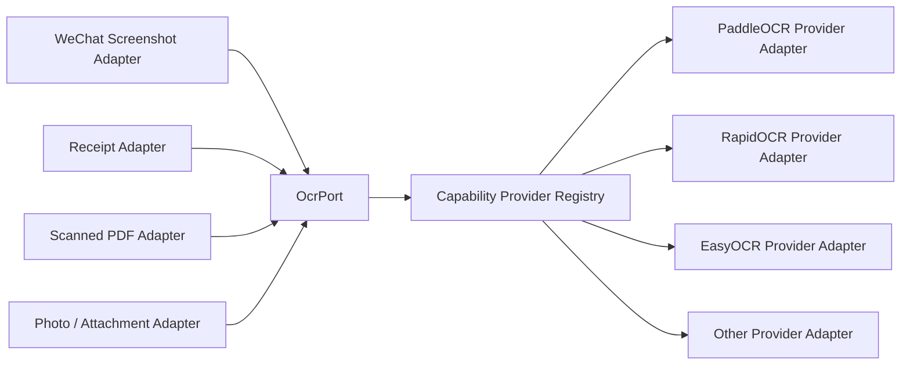
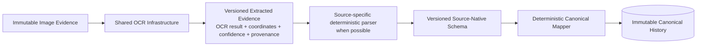

# Shawn Life OS — Shared Capability Infrastructure

Status: Long-term architecture design. This document defines reusable infrastructure capabilities that can be consumed by multiple DataSource plugins and processing pipelines.

## 1. Principle

Commodity capabilities that are useful across multiple DataSources must not be owned by one source plugin. They belong behind stable Life OS capability ports and are supplied by configurable providers.

Preferred dependency direction:

`DataSource / Pipeline -> Life OS Capability Port -> Provider Adapter -> Open-source / External Implementation`

Examples of shared capabilities include OCR, speech-to-text, document parsing, media metadata extraction, embeddings, model inference, image preprocessing, and similar reusable infrastructure.

## 2. OCR is shared infrastructure

OCR is not a WeChat-specific feature. The WeChat screenshot adapter consumes OCR through an `OcrPort`; receipt ingestion, scanned-PDF ingestion, photo ingestion, attachment processing, and future image-based DataSources may use the same port and provider registry.

The WeChat plugin must not bundle or directly depend on one specific OCR engine in its canonical source logic.



## 3. Capability provider contract

A reusable capability provider declares at minimum:

- stable capability type, e.g. `ocr`;
- stable provider ID;
- provider adapter version;
- underlying project/model/runtime version or commit when applicable;
- configuration schema;
- input semantic schema(s);
- output semantic schema(s);
- supported languages/formats/features;
- resource requirements;
- local/remote execution mode;
- privacy/egress characteristics;
- health/readiness behavior;
- deterministic/non-deterministic characteristics;
- provenance fields required on every result;
- known limitations;
- replacement/exit strategy.

Providers are selected declaratively by configuration and may be changed without modifying the consuming DataSource plugin, provided the selected provider satisfies the declared capability contract.

## 4. OCR port

Conceptual contract:

```text
OcrPort
  recognize(OcrRequest) -> OcrResult

OcrRequest
  - evidence/content reference
  - content hash
  - media type
  - language hints
  - region/crop hints
  - execution/privacy policy
  - requested output schema

OcrResult
  - schemaRef
  - providerRef
  - provider/version/model provenance
  - source evidence reference
  - extracted regions / text boxes
  - coordinates
  - confidence when supplied by provider
  - warnings / partial status
  - processing timestamp
  - deterministic preprocessing provenance
```

The result contract is Life OS-owned; provider-specific representations are converted inside provider adapters.

## 5. OCR output is extracted evidence, not canonical fact

OCR may be probabilistic. Therefore OCR output must not directly create or overwrite canonical facts solely because text was recognized.

Required separation:



If downstream factual promotion depends on uncertain OCR interpretation, the uncertainty must remain represented. Where required by the source contract, promotion may require deterministic validation, corroborating evidence, or explicit human review. Provider confidence is evidence metadata, not canonical truth.

## 6. WeChat usage

The first WeChat screenshot path becomes:

`WeChat DataSource -> Screenshot Acquisition Adapter -> OcrPort -> configured OCR provider -> OCR extracted-evidence schema -> WhoChat/source parser -> wechat.normalized-chat@version -> typed Life OS pipeline -> SourceRevision -> deterministic canonical message mapping`

WhoChat remains a source-specific parser/replay implementation behind the WeChat adapter boundary. OCR remains shared infrastructure and can be independently upgraded, benchmarked, replaced, or reused.

## 7. Configuration

Example conceptual configuration:

```yaml
capabilities:
  ocr:
    defaultProvider: paddleocr-local
    providers:
      paddleocr-local:
        adapter: paddleocr
        enabled: true
        execution: local
        languages: [zh, en]
        egress: none

sources:
  wechat-main:
    plugin: wechat
    acquisition: screenshot
    capabilities:
      ocr: paddleocr-local
```

DataSource configuration refers to capability/provider IDs rather than embedding provider implementation details in source-domain logic.

## 8. Provider registry and lifecycle

Shared capability providers are discoverable and independently lifecycle-managed:

`DISCOVERED -> CONFIGURED -> VALIDATED -> ACTIVE -> DEGRADED/DISABLED -> ACTIVE or REMOVED`

A provider failure must fail explicitly at the capability boundary. It must not silently substitute another provider unless an explicit, versioned fallback policy permits that behavior and records the actual provider used in provenance.

## 9. Open-source-first

For each capability, evaluate mature open-source implementations before writing custom engines. For OCR, candidate providers may include PaddleOCR, RapidOCR, EasyOCR, or other suitable maintained projects.

Life OS should own:

- the capability port;
- provider registry/configuration;
- semantic input/output contracts;
- privacy/egress policy;
- provider provenance;
- deterministic preprocessing/post-processing that is truly Life OS-specific;
- validation and benchmark harnesses.

Life OS should not reimplement mature OCR engines without a documented reuse rejection decision.

## 10. Testing

Shared capabilities are tested independently from individual DataSources and again through source integration tests.

OCR validation should include:

- public real-world image corpora and upstream fixtures where legally usable;
- provider-version provenance;
- Chinese/English mixed text;
- coordinates/reading order;
- partial/cropped images;
- resize/compression/blur/dark-mode mutations derived from real images;
- deterministic replay of stored provider output for source-parser tests;
- provider failure and timeout behavior;
- privacy/egress enforcement;
- schema compatibility.

A WeChat parser test should not need a live OCR engine when a versioned OCR-result fixture is sufficient; a separate end-to-end OCR benchmark proves the provider path.

## 11. Generalization

The same infrastructure pattern should be reused for other cross-source capabilities:

```text
CapabilityPort
  -> ProviderRegistry
      -> ProviderAdapter A
      -> ProviderAdapter B
      -> ProviderAdapter C
```

This keeps DataSource plugins small, configurable, and source-focused while commodity infrastructure is shared, replaceable, benchmarkable, and provenance-aware.